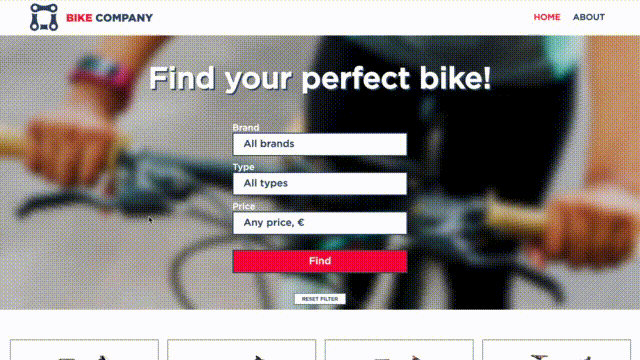

## django-bikeshop

___
### install
```
python3 -m venv venv
```
```
source ./venv/bin/activate
```
```
pip install --upgrade -r requirements.txt
```
```
python manage.py runserver
```
___

## Demo

